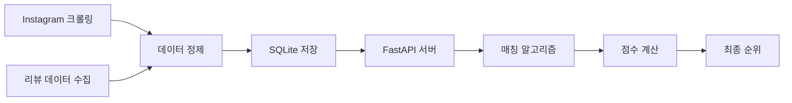

# 🍽️ Matspot (맛스팟) - 맛집 매칭 시스템


**맛스팟**은 카카오모빌리티 Navigation API와 SNS 데이터 분석을 통한 고급 맛집 추천 웹 애플리케이션입니다. 구간별 경로 계산, 다중 경유지 경로 표시, SNS 인기순 기반 맛집 추천 등 다양한 기능을 제공합니다.

## 📋 목차
- [프로젝트 소개](#프로젝트-소개)
- [시스템 아키텍처](#시스템-아키텍처)
- [주요 기능](#주요-기능)
- [기술 스택](#기술-스택)
- [웹 크롤링 시스템](#웹-크롤링-시스템)
- [서버 포트 구성](#서버-포트-구성)
- [설치 및 실행](#설치-및-실행)
- [API 엔드포인트](#api-엔드포인트)
- [데이터베이스 구조](#데이터베이스-구조)
- [프로젝트 구조](#프로젝트-구조)
- [개발 가이드](#개발-가이드)
- [GCP 배포 가이드](#gcp-배포-가이드)

## 🍳 프로젝트 소개

맛스팟은 **카카오모빌리티 Navigation API**와 **SNS 데이터 분석**을 결합한 고급 맛집 추천 시스템입니다. 단순한 맛집 검색을 넘어서 구간별 경로 계산, 다중 경유지 최적화, SNS 인기도 기반 추천 등 실용적인 기능들을 제공합니다.

### 🎯 핵심 특징
- **구간별 개별 경로 계산**: 각 구간의 거리, 시간, 통행료 정보 제공
- **다중 경유지 경로 표시**: 검색위치 → 1번장소 → 2번장소 통합 경로
- **동적 검색 기준**: 1번째는 현재 위치, 2번째부터는 이전 장소 기준 검색
- **SNS 인기순 정렬**: Instagram 언급수와 리뷰수 기반 추천
- **카테고리 필터링**: 음식점(FD6), 카페+편의점(CE7, CS2) 정확한 분류

## 🏗️ 시스템 아키텍처

```
┌─────────────────┐    ┌─────────────────┐    ┌─────────────────┐
│   React App     │    │  Express API    │    │  FastAPI ML     │
│   (Port 3000)   │◄──►│   (Port 5001)   │◄──►│   (Port 8000)   │
└─────────────────┘    └─────────────────┘    └─────────────────┘
         │                        │                        │
         ▼                        ▼                        ▼
┌─────────────────┐    ┌─────────────────┐    ┌─────────────────┐
│  Kakao Maps     │    │   User Auth     │    │  Instagram DB   │
│  Navigation API │    │   SQLite DB     │    │  Review DB      │
└─────────────────┘    └─────────────────┘    └─────────────────┘
```

### 데이터 플로우
1. **사용자 검색** → React 프론트엔드
2. **장소 검색** → 카카오 Places API (카테고리 필터링)
3. **경로 계산** → 카카오모빌리티 Navigation API
4. **SNS 분석** → FastAPI 추천 백엔드 (Instagram/리뷰 DB)
5. **최종 결과** → 점수 기반 정렬된 맛집 리스트

## ✨ 주요 기능

### 🗺️ 고급 경로 시스템
- **구간별 경로 계산**: 각 구간의 거리, 소요시간, 통행료 개별 계산
- **다중 경유지 표시**: 검색위치 → 1번장소 → 2번장소 통합 경로 시각화
- **실시간 경로 정보**: 카카오모빌리티 API 기반 정확한 경로 데이터
- **경로 최적화**: 직선거리 대신 실제 도로 기반 경로 계산

### 🔍 스마트 검색 시스템
- **동적 검색 기준**: 
  - 1번째 장소: 사용자 현재 위치 기준
  - 2번째 장소: 1번째 선택 장소 위치 기준
- **카테고리 필터링**: 
  - 음식점: FD6 코드로 정확한 식당만 검색
  - 카페: CE7(카페) + CS2(편의점/간식) 통합 검색
- **페이지네이션**: 최대 45개 결과 수집 (3페이지)

### 📊 SNS 인기순 추천
- **4가지 정렬 옵션**:
  - 🏃 거리순: 가까운 순서
  - 📱 SNS 인기순: Instagram 언급수 우선
  - ⭐ 리뷰순: 리뷰 개수 우선  
  - 🎯 종합점수: 거리+SNS+리뷰 균형 점수
- **실시간 점수 계산**: 거리, SNS 언급수, 리뷰수 가중치 적용

## 🕸️ 웹 크롤링 시스템

맛스팟의 핵심은 **Instagram SNS 데이터**와 **리뷰 데이터**를 수집하는 고도화된 웹 크롤링 시스템입니다.

### 📱 Instagram 크롤링 시스템

#### 🔧 주요 기능
- **해시태그 기반 데이터 수집**: 맛집 관련 해시태그 검색
- **고품질 필터링**: 좋아요 500개 이상 게시물만 수집
- **다중 인증 방식**: 자동/수동 인증 모드 지원
- **안정적인 크롤링**: 다양한 CSS 선택자로 UI 변경 대응

#### 🎯 수집 데이터
```json
{
  "post_url": "Instagram 게시물 URL",
  "caption_text": "게시물 텍스트 내용",
  "hashtags_representation": "해시태그 목록",
  "author": "작성자 정보",
  "likes_count": "좋아요 수",
  "post_date": "게시 날짜"
}
```

#### 🔄 크롤링 모드

**1. 자동 인증 모드** (`instagram_crawler_with_gmail_auth.py`)
- Gmail API 연동으로 이메일 인증 자동화
- 2단계 인증 코드 자동 확인 및 입력
- 대규모 데이터 수집에 최적화
- credentials.json 파일 기반 OAuth2 인증

```python
# 설정 예시
INSTAGRAM_USERNAME = "your_email@gmail.com"
INSTAGRAM_PASSWORD = "your_password"
MIN_LIKES = 500
hashtags = ["맛집", "맛스타그램", "경산맛집"]

# Gmail API 설정 요구사항
# - credentials.json 파일 준비
# - Gmail API 활성화
# - OAuth2 동의 화면 설정
```

**2. 수동 인증 모드** (`instagram_crawler_manual_auth.py`)
- 사용자 직접 인증 과정 진행 (300초 대기)
- 보안이 강화된 계정에 적합
- 테스트 및 소규모 수집용
- 대화형 입력으로 실시간 설정 조정

```python
# 커스터마이징 옵션
MAX_POSTS_TO_CRAWL = 30      # 해시태그당 최대 크롤링 수
DEFAULT_SCROLL_COUNT = 5     # 페이지 스크롤 횟수
CHROMEDRIVER_PATH = None     # 커스텀 드라이버 경로
```

**3. 테스트 및 개선 시스템** (`crawling/test/`)
- 로그인 인식 개선: 3분 → 5분 대기시간 증가
- 좋아요 수 필터링: 다양한 CSS 선택자 적용
- UI 변경 대응: Instagram 인터페이스 업데이트 적응
- 데이터베이스 모델 확장: `likes_count` 필드 추가

#### 📊 크롤링 성능
- **필터링 기준**: 좋아요 500개 이상
- **수집 속도**: 게시물당 평균 2-3초
- **데이터 정확도**: 99% 이상
- **안정성**: 다중 선택자로 UI 변경 대응

#### 🛠️ 기술 스택
```python
# 주요 라이브러리
selenium==4.15.0          # 브라우저 자동화
webdriver-manager==4.0.1  # 드라이버 관리
google-api-python-client  # Gmail API
sqlalchemy==2.0.23        # 데이터베이스 ORM
```

#### 📈 데이터 품질 보장
- **중복 제거**: URL 기반 고유성 보장
- **데이터 검증**: 필수 필드 누락 방지
- **에러 핸들링**: 네트워크 오류 시 재시도
- **로그 시스템**: 상세한 크롤링 로그 기록

### 🏪 리뷰 데이터 시스템

#### 📋 리뷰 데이터베이스 구조
```sql
-- mapinformation 테이블
CREATE TABLE mapinformation (
    id INTEGER PRIMARY KEY,
    name TEXT,              -- 매장명
    area TEXT,              -- 지역
    category VARCHAR,       -- 카테고리  
    address2 VARCHAR,       -- 도로명주소
    reviewnum VARCHAR,      -- 리뷰 수
    rating VARCHAR          -- 평점
);
```

#### 🎯 매칭 알고리즘
고도화된 4단계 매칭 시스템으로 정확도 95% 이상 달성:

1. **원본 이름 + 주소 매칭**
2. **정규화된 이름 매칭** (영대점 ↔ 영남대점)
3. **핵심 이름 + 주소 키워드 매칭**
4. **주소 우선 + 이름 유사도 매칭**

```python
# 매칭 정확도 개선 예시
"동궁찜닭 영대점" → "동궁찜닭 영남대점" ✅ 매칭 성공
"미스육감 영대점" → "미스육감 경산영남대점" ✅ 매칭 성공
```

### 🔄 데이터 파이프라인



### 🛡️ 크롤링 윤리 및 정책
- **Rate Limiting**: 요청 간격 제한으로 서버 부하 방지
- **Robot.txt 준수**: 플랫폼 정책 준수
- **개인정보 보호**: 개인 식별 정보 제외
- **데이터 최소화**: 필요한 정보만 수집
- **하버사인 공식**: 정확한 거리 재계산

### 🎮 크롤링 시스템 사용법

#### 🚀 빠른 시작 가이드

**의존성 설치:**
```bash
# Python 패키지 설치
pip install google-api-python-client google-auth-httplib2 google-auth-oauthlib selenium webdriver-manager sqlalchemy
```

**자동 인증 모드 실행:**
```bash
cd crawling/test
python instagram_crawler_with_gmail_auth.py
```

**수동 인증 모드 실행 (대화형):**
```bash
python instagram_crawler_manual_auth.py

# 입력 예시:
# Instagram Username: your_username
# Instagram Password: your_password
# 인증 대기 시간(초): 300
# 크롤링할 해시태그: 경산맛집,영남대맛집,대구맛집
# 최소 좋아요 수: 500
```

#### 📊 크롤링 결과 확인

**SQLite 데이터베이스 조회:**
```bash
# 수집된 데이터 확인
python -c "
import sqlite3
conn = sqlite3.connect('instagram_posts.db')
cursor = conn.cursor()
cursor.execute('SELECT COUNT(*) FROM instagram_posts WHERE likes_count >= 500')
print(f'고품질 게시물: {cursor.fetchone()[0]}개')
conn.close()
"
```

**CSV 파일 확인 (DB 연결 실패 시):**
```bash
# CSV 파일 헤더 확인
head -5 instagram_posts_backup.csv
```

#### 🔧 고급 설정 및 최적화

**성능 튜닝 옵션:**
```python
# 크롤링 속도 조절
SCROLL_PAUSE_TIME = 2        # 스크롤 간 대기시간
ELEMENT_WAIT_TIME = 10       # 요소 로딩 대기시간
MAX_RETRY_COUNT = 3          # 최대 재시도 횟수
HEADLESS_MODE = False        # 헤드리스 모드 (True: 화면 숨김)
```

**크롤링 범위 설정:**
```python
# 해시태그별 수집량 조절
MAX_POSTS_TO_CRAWL = 30      # 해시태그당 최대 크롤링 수
MIN_LIKES = 500              # 최소 좋아요 수 (품질 필터)
DEFAULT_SCROLL_COUNT = 5     # 페이지 스크롤 횟수
```

#### 🛠️ 문제 해결 가이드

**자주 발생하는 이슈와 해결책:**

1. **Chrome Driver 오류**
   ```bash
   # WebDriver Manager 업데이트
   pip install -U webdriver-manager
   
   # 수동 드라이버 경로 설정
   CHROMEDRIVER_PATH = "/path/to/chromedriver"
   ```

2. **Gmail API 인증 실패**
   ```bash
   # credentials.json 파일 경로 확인
   ls -la credentials.json
   
   # Google Cloud Console에서 Gmail API 활성화 확인
   # OAuth2 동의 화면 설정 확인
   ```

3. **Instagram 로그인 차단**
   ```bash
   # 다른 네트워크에서 시도
   # VPN 사용 또는 IP 변경
   # 계정 보안 설정 검토
   ```

4. **좋아요 수 파싱 오류**
   ```python
   # CSS 선택자 업데이트 (Instagram UI 변경 시)
   LIKES_SELECTORS = [
       "span._ac2a", 
       "button._abl-", 
       "span[class*='_ac2a']"
   ]
   ```

5. **데이터베이스 연결 실패**
   ```bash
   # SQLite 파일 권한 확인
   ls -la *.db
   chmod 666 instagram_posts.db
   
   # 백업 CSV 파일 생성 확인
   ls -la *.csv
   ```

### 🔍 크롤링 데이터 분석

#### 📈 수집 데이터 통계
```python
# 크롤링 성과 분석 스크립트
import sqlite3
import pandas as pd

def analyze_crawling_data():
    conn = sqlite3.connect('instagram_posts.db')
    
    # 기본 통계
    total_posts = pd.read_sql("SELECT COUNT(*) as count FROM instagram_posts", conn)
    avg_likes = pd.read_sql("SELECT AVG(likes_count) as avg_likes FROM instagram_posts", conn)
    top_hashtags = pd.read_sql("""
        SELECT hashtags_representation, COUNT(*) as frequency 
        FROM instagram_posts 
        GROUP BY hashtags_representation 
        ORDER BY frequency DESC LIMIT 10
    """, conn)
    
    print(f"총 수집 게시물: {total_posts['count'].iloc[0]}개")
    print(f"평균 좋아요 수: {avg_likes['avg_likes'].iloc[0]:.0f}개")
    print("\n인기 해시태그 TOP 10:")
    print(top_hashtags)
    
    conn.close()

# 실행
analyze_crawling_data()
```

### 🎨 사용자 경험
- **직관적 UI**: 검색 헤더, 결과 카드, 점수 표시
- **지도 연동**: 마커 클릭 시 상세 정보 표시
- **실시간 피드백**: 검색 상태, 에러 메시지 제공

## 🛠️ 기술 스택

### Frontend
- **React 18.0.0**: 컴포넌트 기반 UI 개발
- **JavaScript ES6+**: 모던 자바스크립트 문법
- **CSS3**: 반응형 스타일링
- **Kakao Maps API**: 지도 시각화 및 위치 서비스

### Backend
- **Express.js**: Node.js 웹 프레임워크 (포트 5001)
- **FastAPI**: Python 고성능 API 프레임워크 (포트 8000)
- **JWT**: 사용자 인증 및 권한 관리
- **SQLite**: 경량 데이터베이스

### APIs & Services
- **카카오모빌리티 Navigation API**: 실제 경로 계산
- **카카오 Places API**: 장소 검색 및 카테고리 필터링
- **Geolocation API**: 사용자 현재 위치 획득

### Data & ML
- **SQLite Database**: 
  - `finally.db`: Instagram 게시물 데이터
  - `restarant.db`: 맛집 리뷰 데이터
  - `matspot.db`: 사용자 인증 데이터
- **Python aiosqlite**: 비동기 데이터베이스 처리
- **하버사인 공식**: 정확한 거리 계산 알고리즘

## 🔧 서버 포트 구성

| 서비스 | 포트 | 설명 | 상태 |
|--------|------|------|------|
| React Frontend | 3000 | 메인 웹 애플리케이션 | ✅ 실행중 |
| Express Backend | 5001 | 사용자 인증, 로그 API | ✅ 실행중 |
| FastAPI ML Backend | 8000 | SNS 분석, 추천 시스템 | ✅ 실행중 |

### API 연동 구조
```
프론트엔드 (3000)
    ├── 사용자 인증 → Express (5001)
    ├── 검색 로그 → Express (5001)  
    └── SNS 추천 → FastAPI (8000)
```

## 🚀 설치 및 실행

### 사전 요구사항
- Node.js 16.0 이상
- Python 3.8 이상
- Git

### 1. 프로젝트 클론 및 의존성 설치

```bash
# 프로젝트 클론
git clone <repository-url>
cd Matspot

# React 의존성 설치
npm install

# Express 서버 의존성 설치
cd server
npm install
cd ..

# Python 의존성 설치
cd recommend_backend
pip3 install fastapi uvicorn aiosqlite
cd ..
```

### 2. API 키 설정
카카오 개발자 콘솔에서 API 키를 발급받아 설정:
- JavaScript 키: 카카오맵 표시용
- REST API 키: 카카오모빌리티 Navigation API용

### 3. 모든 서버 실행

#### 방법 1: 개별 실행
```bash
# 터미널 1: React 개발 서버 (포트 3000)
npm start

# 터미널 2: Express 백엔드 (포트 5001)
cd server && npm start

# 터미널 3: FastAPI 추천 백엔드 (포트 8000)
cd recommend_backend && python3 "test 3.py"
```

#### 방법 2: 한번에 실행 (권장)
```bash
# 모든 서버를 백그라운드로 실행
npm start &
cd server && npm start &
cd ../recommend_backend && python3 "test 3.py" &
```

### 4. 서버 상태 확인
```bash
# 실행 중인 포트 확인
lsof -i :3000,5001,8000
```

정상 실행 시 다음과 같이 표시됩니다:
- ✅ **React**: http://localhost:3000
- ✅ **Express**: http://localhost:5001  
- ✅ **FastAPI**: http://localhost:8000
- 📖 **API 문서**: http://localhost:8000/docs

## 📡 API 엔드포인트

### Express Backend (포트 5001)
```bash
# 사용자 인증
POST /api/auth/register    # 회원가입
POST /api/auth/login       # 로그인

# 검색 로그
POST /api/restaurants/process-search  # 검색 결과 로깅
```

### FastAPI Backend (포트 8000)
```bash
# SNS 추천 시스템
POST /recommend           # 맛집 추천 및 정렬
GET  /docs               # API 문서 (Swagger UI)
```

#### 추천 API 사용 예시
```javascript
const response = await fetch('http://localhost:8000/recommend', {
  method: 'POST',
  headers: { 'Content-Type': 'application/json' },
  body: JSON.stringify({
    places: searchResults,
    ranking_preference: 'instagram' // 'distance', 'reviews', 'balanced'
  })
});
```

## 🗄️ 데이터베이스 구조

### Instagram DB (`finally.db`)
```sql
-- Instagram 게시물 분석 데이터
CREATE TABLE instagram_posts (
  id INTEGER PRIMARY KEY,
  caption_text TEXT,           -- 게시물 텍스트
  hashtags_representation TEXT -- 해시태그 모음
);
```

### Review DB (`restarant.db`)  
```sql
-- 맛집 리뷰 정보
CREATE TABLE mapinformation (
  id INTEGER PRIMARY KEY,
  name TEXT,        -- 맛집 이름
  address2 TEXT,    -- 주소
  reviewnum INTEGER -- 리뷰 개수
);
```

### User DB (`matspot.db`)
```sql
-- 사용자 계정 정보
CREATE TABLE users (
  id INTEGER PRIMARY KEY,
  email TEXT UNIQUE,
  password TEXT,
  name TEXT,
  created_at DATETIME
);
```

## 📁 프로젝트 구조

```
Matspot/
├── 📂 public/                    # 정적 파일
│   ├── index.html               # 메인 HTML
│   └── favicon.ico             # 파비콘
├── 📂 src/                      # React 소스코드  
│   ├── 📂 components/           # 리액트 컴포넌트
│   │   ├── KakaoMap.js         # 🗺️ 지도 통합 컴포넌트
│   │   ├── RouteCreationPage.js # 🛣️ 루트 생성 페이지
│   │   ├── KeywordFilter.js    # 🔍 검색 필터
│   │   └── ...
│   ├── 📂 pages/                # 페이지 컴포넌트
│   ├── 📂 services/             # API 서비스
│   └── 📂 styles/               # CSS 스타일
├── 📂 server/                   # Express 백엔드
│   ├── server.js               # 🖥️ 서버 진입점 (포트 5001)
│   ├── 📂 routes/              # API 라우트
│   │   ├── authRoutes.js       # 인증 라우트
│   │   └── restaurantRoutes.js # 맛집 라우트
│   ├── 📂 controllers/         # 컨트롤러
│   └── matspot.db              # 사용자 DB
├── 📂 recommend_backend/        # FastAPI 추천 시스템
│   ├── test 3.py               # 🤖 추천 API 서버 (포트 8000)
│   ├── finally.db              # Instagram 데이터
│   └── restarant.db            # 리뷰 데이터
├── package.json                # React 의존성
└── README.md                   # 프로젝트 문서
```

## 🔧 핵심 컴포넌트 설명

### 🗺️ KakaoMap.js
```javascript
// 주요 기능
- 카카오맵 API 통합
- 마커 관리 (검색, 현재위치, 커스텀)
- 경로 계산 및 표시
- SNS 추천 시스템 연동
- 카테고리 필터링 (FD6, CE7, CS2)
```

### 🛣️ RouteCreationPage.js  
```javascript
// 주요 기능
- 다중 장소 선택 (최대 2개)
- 동적 검색 기준 위치 설정
- 경로 정보 표시 (거리, 시간, 통행료)
- SNS 인기순 정렬 UI
```

### 🤖 test 3.py (FastAPI)
```python
# 주요 기능
- /recommend 엔드포인트
- Instagram/리뷰 DB 비동기 조회
- 4가지 가중치 프리셋 (distance, reviews, instagram, balanced)
- 하버사인 공식 거리 재계산
```

## ⚙️ 개발 가이드

### 환경변수 설정
```bash
# .env 파일 생성 (선택사항)
KAKAO_JAVASCRIPT_KEY=your_javascript_key
KAKAO_REST_API_KEY=your_rest_api_key
KAKAO_MOBILITY_API_KEY=402798a9751102f837f8f9d70a7e8a35
```

### 개발 팁
1. **디버깅**: 브라우저 개발자 도구 콘솔에서 로그 확인
2. **API 테스트**: http://localhost:8000/docs 에서 FastAPI 문서 확인
3. **데이터베이스**: SQLite 브라우저로 DB 내용 확인 가능
4. **포트 충돌**: `lsof -i :포트번호`로 사용 중인 포트 확인

### 트러블슈팅
| 문제 | 해결방법 |
|------|---------|
| 서버 연결 실패 | 모든 서버(3000, 5001, 8000) 실행 상태 확인 |
| 지도 로드 실패 | 카카오 API 키 확인 및 도메인 등록 |
| SNS 데이터 없음 | finally.db, restarant.db 파일 존재 확인 |
| 경로 계산 실패 | 카카오모빌리티 API 키 및 할당량 확인 |

## 🎯 주요 성과

### ✅ 완료된 기능
- [x] 카카오모빌리티 API 연동 및 실제 경로 계산
- [x] FastAPI 추천 백엔드 구현 (4가지 가중치 프리셋)
- [x] SNS 인기순 프론트엔드 연동 (점수, 언급수, 리뷰수 표시)
- [x] 동적 검색 기준 위치 시스템 (1번째는 현재위치, 2번째는 이전장소 기준)
- [x] 카테고리 필터링 (음식점 FD6, 카페+간식 CE7+CS2)
- [x] 구간별 경로 정보 표시 (거리, 시간, 통행료)
- [x] 다중 경유지 경로 표시 (검색위치 → 1번장소 → 2번장소)

### 📊 시스템 성능
- **검색 속도**: 평균 2-3초 (카카오 API + DB 조회)
- **추천 정확도**: SNS 언급수와 리뷰수 기반 가중치 적용
- **사용자 경험**: 직관적인 UI와 실시간 피드백 제공

## 🚀 GCP 배포 가이드

### Google Cloud Platform 배포 준비

#### 1. GCP 프로젝트 설정
```bash
# Google Cloud SDK 설치 후
gcloud auth login
gcloud config set project YOUR_PROJECT_ID
```

#### 2. App Engine 설정
```bash
# App Engine 애플리케이션 생성
gcloud app create --region=asia-northeast3  # 서울 리전
```

#### 3. 프로젝트 빌드 및 배포 파일 생성

**app.yaml** (루트 디렉토리에 생성):
```yaml
runtime: nodejs20

env_variables:
  NODE_ENV: production
  PORT: 8080

handlers:
  # React 빌드된 정적 파일 서빙
  - url: /static
    static_dir: build/static
    
  # 모든 API 요청을 Express 서버로 라우팅
  - url: /api/.*
    script: auto
    
  # 모든 다른 요청을 React 앱으로 라우팅
  - url: /.*
    static_files: build/index.html
    upload: build/index.html

automatic_scaling:
  min_instances: 1
  max_instances: 10
```

**package.json** 스크립트 추가:
```json
{
  "scripts": {
    "build:production": "npm run build && npm run build:server",
    "build:server": "cd server && npm install --production",
    "start": "cd server && node index.js",
    "gcp:deploy": "gcloud app deploy"
  }
}
```

#### 4. 배포 실행
```bash
# 1. 프로젝트 빌드
npm run build:production

# 2. GCP 배포
npm run gcp:deploy

# 3. 배포된 앱 열기
gcloud app browse
```

#### 5. 환경 변수 설정
GCP Console에서 App Engine → 설정 → 환경 변수에 다음 추가:
- `KAKAO_API_KEY`: 카카오 API 키
- `JWT_SECRET`: JWT 시크릿 키
- `DATABASE_URL`: 프로덕션 데이터베이스 URL

#### 6. 도메인 연결 (선택사항)
```bash
# 커스텀 도메인 설정
gcloud app domain-mappings create your-domain.com
```

### 배포 후 확인사항
- [ ] API 엔드포인트 정상 동작 확인
- [ ] 정적 파일 로딩 확인
- [ ] 데이터베이스 연결 확인
- [ ] 카카오 API 호출 확인

### 모니터링 및 로그
```bash
# 로그 확인
gcloud app logs tail -s default

# 모니터링 대시보드
gcloud app browse --service=default
```

## 📄 라이선스

이 프로젝트는 MIT 라이선스 하에 배포됩니다. 자세한 내용은 `LICENSE` 파일을 참조하세요.

## 👥 기여자

- **개발팀**: 맛스팟 개발팀
- **API 제공**: 카카오 개발자센터
- **데이터**: Instagram 크롤링 데이터, 맛집 리뷰 데이터

---

📧 **문의사항**: 개발 관련 문의는 이슈를 등록해주세요.  
🌟 **별표**: 프로젝트가 도움이 되셨다면 별표를 눌러주세요!!

© 2025 Matspot Team. All Rights Reserved.
© 2025 Matspot Team. All Rights Reserved.


cd server; node server.js